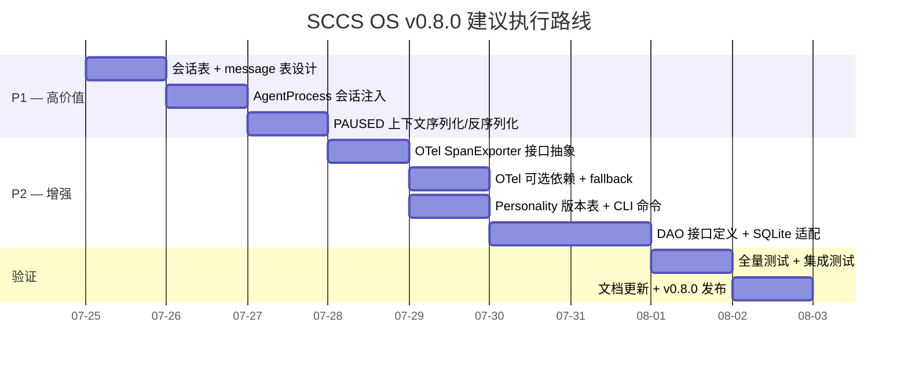

# SCCS OS v0.8.0 深度架构设计与可行性评估

> **版本**: v0.8.0（规划中）| **健康目标**: 9.0/10
> **前置**: [[ADR-004-sccsos-v0.7.0-architecture-refactor]], [[sccsos-architecture-framework]]
> **状态**: 🟡 规划阶段 — 待评审

---

## 评估框架

每个候选方向按五个维度评估：

| 维度 | 说明 |
|------|------|
| **业务价值** | 对最终用户和运维的意义 (1-5) |
| **技术风险** | 实现复杂度和破坏性 (1-5, 越高越危险) |
| **工作量** | 估算人天（单人 Python 3.11） |
| **依赖** | 前置条件 / 外部依赖 |
| **优先级** | 🔴 P0 / 🟡 P1 / 🟢 P2 |

---

## 候选方向 1：会话持久化（Conversation Persistence）

### 当前状态

- Agent 对话通过 `AgentRunner.ask_agent()` → `AgentProcess.ask()` → `adapter.delegate_task()` 直通 Hermes CLI
- 每次 `agent ask` 是一次独立的 Hermes 调用，无会话上下文
- PAUSED 状态已经能停启 runner（v0.7.0 修复），但无法保存/恢复对话上下文
- `MemoryStore` 只有 KV 语义，不支持对话历史查询

### 目标

```
agent ask architect "设计认证模块"  →  记录到会话历史
agent ask architect "继续"          →  自动带上历史上下文
agent pause architect               →  序列化会话到 DB
agent resume architect              →  反序列化恢复会话
```

### 技术方案

| 方案 | 实现路径 | 优点 | 缺点 |
|------|---------|------|------|
| **A: SQLite 会话表** | 新增 `agent_sessions` 表 + `session_messages` 表；每次 ask 追加消息；resume 时将历史注入 prompt 前缀 | 无外部依赖；与现有 schema 一致 | 长对话 token 膨胀；查询历史慢 |
| **B: 文件存储 + 索引** | 每会话一个 JSONL 文件 + DB 索引元数据；注入时读取最后 N 轮 | 读写快；文件可独立归档 | 管理多个文件；无事务保证 |
| **C: 复用 Hermes 配置文件** | 不自己存储，用 Hermes profile 本身的 memory/skill 机制 | 零存储代码；复用已有能力 | 绑定 Hermes 实现；profile 污染 |

**推荐方案 A**（渐进式）：

第一阶段（最小可行）：
```
CREATE TABLE agent_sessions (
    id TEXT PRIMARY KEY,
    agent_name TEXT NOT NULL,
    tenant_id TEXT NOT NULL,
    status TEXT DEFAULT 'active',  -- active | paused | closed
    created_at TIMESTAMP,
    updated_at TIMESTAMP,
    context_summary TEXT          -- 用于 resume 时快速注入
);

CREATE TABLE session_messages (
    id INTEGER PRIMARY KEY AUTOINCREMENT,
    session_id TEXT NOT NULL,
    role TEXT NOT NULL,           -- 'user' | 'assistant'
    content TEXT NOT NULL,
    tokens INTEGER DEFAULT 0,
    created_at TIMESTAMP
);
```

第二阶段（上下文管理）：
- `context_summary` 字段：定时或对话轮数阈值触发 LLM 摘要
- 注入策略：resume 时注入最近 5 轮 + context_summary

### 技术风险评估

| 风险 | 概率 | 影响 | 缓解 |
|------|:----:|:----:|------|
| 长对话导致 prompt 超长 | 高 | 中 | 滑动窗口 + 摘要裁剪 |
| PAUSED 状态中断 Hermes 子进程 | 中 | 低 | Pause 时显式结束子进程（已实现） |
| 并发会话冲突 | 低 | 中 | session_id 隔离 + DB 锁 |

**估算**: 3-4 人天（第一阶段） + 2 人天（摘要管理）
**业务价值**: 5/5 | **技术风险**: 2/5 | **优先级**: 🟡 **P1**

---

## 候选方向 2：OpenTelemetry 集成

### 当前状态

- 自研 `Tracer` 类：Span 树 → SQLite 存储 + JSON 合并导出
- `Auditor` 类：Token/cost → SQLite audit_log
- 无标准协议导出，无法对接 Jaeger/Zipkin/Grafana

### 目标

```
sccsos OTLP export → Jaeger UI 查看 trace 树
Grafana dashboard 展示 token 消耗趋势
```

### 技术方案

| 子项 | 方案 | 依赖 |
|------|------|------|
| **Trace Exporter** | `opentelemetry-sdk` + `opentelemetry-exporter-otlp` | 新增 ~3 个 pip 包 (非零依赖) |
| **Span 桥接** | 将 `Tracer.start_span()` 包装为 `OpenTelemetry Span`，span_id/trace_id 映射 | 无 |
| **Metrics** | `opentelemetry-metrics` + 自定义 Instrument | 新增依赖 |
| **Logs** | Python logging 的 OTLP Handler | 新增依赖 |

### 核心架构决策

**问题**: OTel 引入外部依赖是否与当前"零外部依赖"原则冲突？

**分析**:
- 当前 `http.server`, `sqlite3`, `json` 等全内置依赖是 CLI/API 层的设计目标
- 可观测性层引入 OTel 具有明确业务价值（对接企业监控体系）
- 解决方案：将 OTel 设为**可选依赖**（`pip install sccsos[otel]`），无 OTel 时 fallback 到当前自研方案

**接口设计**:
```python
class TraceExporter(ABC):
    """Pluggable trace exporter (current: SQLite+JSON, optional: OTel)."""
    def start_span(self, ...) -> Span: ...
    def end_span(self, ...) -> None: ...
    def export(self) -> None: ...

# 现有实现
class SQLiteTraceExporter(TraceExporter): ...

# 新实现（可选）
class OTelTraceExporter(TraceExporter):
    def __init__(self):
        from opentelemetry import trace  # 延迟导入
        self._tracer = trace.get_tracer("sccsos")
```

### 技术风险评估

| 风险 | 概率 | 影响 | 缓解 |
|------|:----:|:----:|------|
| OTel SDK 版本碎片 | 中 | 中 | pin 版本区间 |
| Span 语义映射不匹配 | 中 | 低 | 抽象接口 + 适配器模式 |
| 可选依赖导致 import 错误 | 低 | 高 | 延迟导入 + try/except + fallback |

**估算**: 3-4 人天
**业务价值**: 4/5 | **技术风险**: 3/5 | **优先级**: 🟢 **P2**

---

## 候选方向 3：文件系统沙箱增强（Filesystem Sandbox）

### 当前状态

- `CommandWhitelist` 检查 shell 命令字符串（危险模式 + 白名单）
- 无文件系统级别的隔离
- Agent 可以通过 `python3 -c "open('/etc/passwd').read()"` 绕过命令白名单

### 目标

```
Agent 只能在限定目录内读写文件
不能读取 /etc, /var, ~/.ssh 等敏感路径
```

### 技术方案

| 方案 | 实现 | 优点 | 缺点 |
|------|------|------|------|
| **A: Hermes 本身能力** | 在 Hermes profile 中配置 `sandbox.directories` 限制 tools 访问路径 | 零实现；复用已有 | 依赖 Hermes 版本；文档不明 |
| **B: Python 级路径守卫** | 在 `read_file`/`search_files`/`terminal` 调用入口加入路径前缀检查 | 完全可控 | 需每个 tool 加守卫；易遗漏 |
| **C: 系统级 jail** | macOS `sandbox-exec` / Linux `bubblewrap` 包装 Hermes CLI | 真正隔离 | 平台绑定；macOS/Linux 不一致 |

**推荐方案：B + 轻量版 A**（持续优先方案 A）：

```python
# security/path_sandbox.py
class PathSandbox:
    """Restrict file operations to allowed directories."""
    def __init__(self, allowed_prefixes: list[Path]):
        self._allowed = [p.resolve() for p in allowed_prefixes]

    def check_read(self, path: str | Path) -> bool:
        resolved = Path(path).resolve()
        return any(
            str(resolved).startswith(str(prefix))
            for prefix in self._allowed
        )

    def check_write(self, path: str | Path) -> bool:
        # Write restriction is stricter
        ...
```

**⚠ 重要限制**: 方案 B 对 `terminal` 工具内的 `python3 -c "..."` 完全无效，因为终端命令在子进程中执行，sccsos 无法拦截其内部的 Python 文件操作。方案 B 本质上是**防护层**而非**隔离层**。

### 技术风险评估

| 风险 | 概率 | 影响 | 缓解 |
|------|:----:|:----:|------|
| terminal 内部绕过 | 高 | 高 | 方案 B 无法解决；需方案 C |
| 路径解析不一致（symlink） | 中 | 高 | 所有路径先 `.resolve()` |
| 影响正常 Workflow 文件操作 | 中 | 中 | 严格测试 + 白名单模式 |

**关键发现**: 文件系统沙箱如果不配合系统级 jail，对 `terminal` 工具的防护是脆弱的。单纯 Python 级守卫更多是"保险丝"而非"防火墙"。

**估算**: 2 人天（基础守卫）+ 4 人天（bubblewrap 集成）
**业务价值**: 3/5 | **技术风险**: 4/5 | **优先级**: 🟢 **P2**（但建议推迟到 v0.9+）

---

## 候选方向 4：多数据库支持（PostgreSQL）

### 当前状态

- 全部持久化走 SQLite
- SQLite 限制：单写者、单文件、无网络访问、无备份/恢复能力
- 当前通过 WAL 模式 + `threading.Lock` 缓解并发问题

### 目标

```
生产环境用 PostgreSQL，开发环境用 SQLite
无缝切换：sccsos.yaml 里改一行配置
```

### 技术方案

**关键决策：是否引入 ORM？**

| 方案 | 优点 | 缺点 |
|------|------|------|
| **A: SQLAlchemy** | 成熟的 DB-agnostic ORM；迁移工具 Alembic | 大依赖(~10MB)；学习曲线 |
| **B: Raw SQL + 多后端** | 无外部依赖；当前代码可复用 | 每个后端 SQL 方言差异手动处理 |
| **C: 抽象 DAO 层** | 定义 DAO 接口 + SQLite/PostgreSQL 实现 | 接口设计需前瞻性 |

**建议**: 采用方案 C（抽象 DAO 层）+ 后续可选方案 A

```python
# core/database/abc.py
class DAODatabase(ABC):
    @abstractmethod
    def execute(self, sql, params): ...
    @abstractmethod
    def fetchone(self, sql, params): ...
    @abstractmethod
    def fetchall(self, sql, params): ...

# core/database/sqlite.py
class SQLiteDatabase(DAODatabase): ...  # 当前 Database 类

# core/database/postgres.py (future)
class PostgresDatabase(DAODatabase): ...  # 需要 psycopg2
```

**⚠ 重要发现**: 当前 `Database` 类深度嵌入系统——除 `MemoryStore` 外，`Tracer`、`Auditor`、`PolicyEngine`、`LifecycleManager`、`WorkflowEngine`、`StepExecutor`、`AlertManager` 全都直接使用 `Database` 实例。重构 DAO 层是**全量重构**。

### DAO 重构影响面分析

| 模块 | 当前耦合方式 | 重构影响 |
|------|-------------|---------|
| `Tracer` | `self._db.get_conn().execute()` | 需要改为 `self._db.execute()`（已部分迁移） |
| `Auditor` | 同上 | 同上 |
| `BudgetTracker` | `self._db.get_conn().execute()` | 同上 |
| `AlertManager` | 同上 | 同上 |
| `LifecycleManager` | 同上 | 同上 |
| `WorkflowEngine` | 同上 | 已迁移至 `self._db.execute()` |
| `StepExecutor` | 同上 + `_db_lock` | 已迁移至 `self._db.execute()` |
| `KnowledgeBase` | 不依赖 DB | 无影响 |
| `MemoryStore` | `self._db.get_conn()` | 需迁移 |

**估算**: 5-7 人天（DAO 接口定义 + 6 模块迁移 + 测试）
**业务价值**: 3/5 | **技术风险**: 4/5 | **优先级**: 🟢 **P2**（但建议处理完 ORM 决策后）

---

## 候选方向 5：Prompt 版本管理

### 当前状态

- Personality YAML 文件直接编辑，无版本历史
- Agent YAML 同样无版本管理
- 无法回滚 prompt 变更；无法对比不同版本的 Agent 行为

### 目标

```
personalities/agent-architect.yaml v1.0 → v1.1 → v1.2
sccsos personality history architect     # 查看版本历史
sccsos personality rollback architect 1.0  # 回滚
```

### 技术方案

| 方案 | 实现 | 优点 | 缺点 |
|------|------|------|------|
| **A: Git 天然管理** | 不新增代码；将所有 `.yaml` 文件纳入 Git | 零实现；复用 Git 能力 | 需要用户自己 commit；无 CLI 集成 |
| **B: DB 版本表** | 新增 `personality_versions` 表，每次更新写快照 | CLI 集成好；可回滚 | 存储膨胀；需 diff 逻辑 |
| **C: 文件 + 审计日志** | YAML 文件在文件系统上，Auditor 记录变更事件 | 轻量 | 无真正版本存储 |

**推荐方案 B**（CLI 集成最佳）：

```sql
CREATE TABLE personality_versions (
    id INTEGER PRIMARY KEY AUTOINCREMENT,
    personality_name TEXT NOT NULL,
    version TEXT NOT NULL,          -- "1.0", "1.1"
    content TEXT NOT NULL,          -- 完整 YAML 内容
    change_log TEXT,
    created_at TIMESTAMP DEFAULT CURRENT_TIMESTAMP,
    UNIQUE(personality_name, version)
);
```

### 技术风险评估

| 风险 | 概率 | 影响 | 缓解 |
|------|:----:|:----:|------|
| personality 文件与 DB 不一致 | 中 | 中 | 读时优先从文件加载，DB 只做审计 |
| 版本膨胀 | 低 | 低 | 保留最近 N 版，旧版清理 |

**估算**: 2 人天
**业务价值**: 3/5 | **技术风险**: 1/5 | **优先级**: 🟢 **P2**

---

## 候选方向 6：Agent-to-Agent 通信协议

### 当前状态

- 所有 Agent 编排是**中心化**的：WorkflowEngine 调度 → HermesAdapter → 子进程
- Agent 之间不能直接通信（一个 Agent 的输出只能通过 `{{ steps.xxx.response }}` 被下游引用）
- 没有 Agent 发现机制

### 目标

```
多 Agent 辩论 / 批评 / 协作
Agent A 可以 "调用" Agent B 的输出
```

### 技术方案

| 方案 | 实现 | 优点 | 缺点 |
|------|------|------|------|
| **A: Workflow 内步骤引用** | 当前机制已支持 `{{ steps.xxx.response }}`；扩展为步骤级 `input_from` 字段 | 零新基础设施 | 仍然是 Workflow 编译时确定 |
| **B: 运行时消息总线** | Agent 输出写入统一消息队列，其他 Agent 订阅 | 真正的解耦 | 引入消息队列依赖 |
| **C: 嵌套 Agent 调用** | Agent 可以在自己的 prompt 中通过 `delegate_task` 调用其他 Agent | 复用已有能力 | 无约束的嵌套调用导致失控 |

**建议**: 当前 `{{ steps.xxx.response }}` 已满足 80% 的协作场景。不需要在 v0.8.0 引入专门的 Agent-to-Agent 协议。

**估算**: 0 人天（当前已足够）
**业务价值**: 2/5 | **技术风险**: 1/5 | **优先级**: 🟢 **推迟**

---

## 候选方向 7：Workflow 图形化编辑器

### 当前状态

- Workflow 以 YAML 编写
- CLI 提供 `workflow visualize` 输出 Mermaid 流程图
- 无可视化编辑界面

### 目标

```
Web UI 拖拽式编辑 Workflow
直接导出 YAML
```

### 技术方案

| 方案 | 实现 | 依赖 |
|------|------|------|
| **A: 扩展现有 API** | `/workflows/editor` 提供 HTML 页面 | 零外部依赖 |
| **B: 集成 React Flow** | 专业的流程编辑器组件 | Node.js 构建 |
| **C: Mermaid Live Editor 集成** | 嵌入 iframe 或调用其 API | 无 |

**建议**: 推迟——v0.8.0 的核心是基础设施（持久化、可观测性），UI 在 v1.0 后。

**估算**: 5-8 人天
**业务价值**: 3/5 | **技术风险**: 3/5 | **优先级**: 🟢 **推迟至 v1.0+**

---

## 优先级总表

| 排名 | 方向 | 业务价值 | 技术风险 | 工作量 | 综合优先级 |
|:----:|------|:--------:|:--------:|:-----:|:----------:|
| 🥇 | **会话持久化（方案 A 第一阶段）** | 5 | 2 | 3-4天 | 🟡 **P1** |
| 🥈 | **OpenTelemetry 集成（可选依赖）** | 4 | 3 | 3-4天 | 🟢 P2 |
| 🥉 | **Prompt 版本管理（方案 B）** | 3 | 1 | 2天 | 🟢 P2 |
| 4 | **多数据库 DAO 层（方案 C）** | 3 | 4 | 5-7天 | 🟢 P2 |
| 5 | **文件系统沙箱（方案 B）** | 3 | 4 | 2+4天 | 🟢 P2 |
| 6 | **Agent-to-Agent 协议** | 2 | 1 | 0天 | 🟢 推迟 |
| 7 | **Workflow 图形编辑器** | 3 | 3 | 5-8天 | 🟢 推迟至 v1.0+ |

---

## 建议的 v0.8.0 执行路线



### 关键建议

1. **v0.8.0 聚焦会话持久化**（P1）—— 这是用户感知最强的能力缺口：目前每次 `agent ask` 都是"失忆"的
2. **OTel 作为可选依赖**——不破坏"零外部依赖"原则，同时为生产环境提供企业级可观测性
3. **DAO 层先设计接口再迁移**——这是基础设施变更，必须做到迁移过程中**零功能回归**
4. **文件系统沙箱推迟至 v0.9+**——当前 terminal 路径守卫无法真正防护 Python 命令内操作，需要配合系统级 jail 才有效

---

## 附录：v0.8.0 关键决策记录

### 决策 1：会话表的 owner 模型

**问题**: 会话归 Agent 所有还是归 Tenant/User 所有？

**决策**: 会话归 `(tenant_id, agent_name)` 所有  
**理由**: 与 `MemoryStore` 的 key 空间一致；一个 agent 在同一 tenant 下只有一个 active 会话  
**例外**: 如果 Workflow 也需要会话（多 Step 共享上下文），则改为 `(tenant_id, session_owner_type, owner_id)`

### 决策 2：OTel SDK 版本策略

**决策**: 锁定 `opentelemetry-api>=1.20,<2.0` 和 `opentelemetry-sdk>=1.20,<2.0`  
**理由**: OTel 1.x 和 2.x 有 breaking changes；1.20 以上支持完整的 trace/metric/log API

### 决策 3：DAO 层是否覆盖全部模块

**决策**: 第一阶段只覆盖 `Database` 类本身（`execute`/`fetchone`/`fetchall`/`executescript`），不重构各消费方  
**理由**: `Database` 的 `execute()` 已经统一了操作接口；各消费方已从 `get_conn().execute()` 迁移至 `db.execute()`。需要变更时再加新的 DAO 方法。
