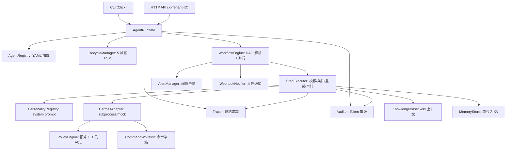
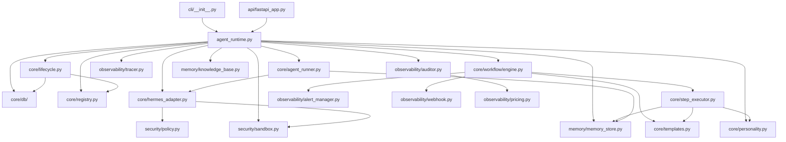

# SCCS OS Architecture Framework — 7-Domain Design

> 版本: v0.16.6 | 最后更新: 2026-07-27
> 对应: ADR-003~ADR-022 | 代码: ~24,000 LoC | 测试: 1208 用例 / 77 文件 | 健康评分: 8.8/10

## 核心原则

1. **不重复造轮子** — 复用 Hermes Agent 的推理、记忆、工具、网关全部能力
2. **分层解耦** — 核心层（自研）与适配层（Hermes API）严格分离
3. **渐进式交付** — 先可用、再稳定、后高阶
4. **默认安全** — 最小权限、最少工具、最窄上下文
5. **多租户原生** — 从 schema 层开始支持租户隔离

## 7-Domain 架构框架

| # | 域 | 职责 | 关键接口 |
|---|-----|------|---------|
| 1 | **多智能体编排** | DAG 拓扑排序、并行 ThreadPool 执行、Jinja2 模板引擎、条件分支、WorkflowRunContext 线程安全 | `WorkflowEngine`, `StepExecutor`, `DAGResolver`, `WorkflowRunContext` |
| 2 | **工具增强型 LLM** | ABC 适配层、子进程桥接 Hermes CLI、策略注入、Personality 注入、retry 瞬态重试 | `HermesAdapter(ABC)`, `HermesSubprocessAdapter`, `PersonalityRegistry` |
| 3 | **Agent 生命周期** | 5 状态状态机 + DB 持久化 + 从 DB 恢复 + AgentRunner 后台线程 + PAUSED 真实停启 | `LifecycleManager`, `AgentStatus`, `AgentInstance`, `AgentRunner`, `AgentProcess` |
| 4 | **可观测性** | Span 追踪、JSON 日志、Token 审计、成本报告、Webhook 通知、阈值告警、trace 合并导出 | `Tracer`, `Logger`, `Auditor`, `PricingTable`, `WebhookNotifier`, `AlertManager` |
| 5 | **安全沙箱** | Budget 预算引擎、工具 ACL 白名单、命令白名单 2 层守卫、per-agent 策略覆盖、危险模式可配置 | `PolicyEngine`, `CommandWhitelist`, `BudgetTracker` |
| 6 | **记忆系统** | 冷记忆桥接(wiki)、TF-IDF 向量检索、KB → 模板注入、跨会话 KV 持久记忆、TTL 过期清理 | `KnowledgeBase`, `VectorStore`, `MemoryStore` |
| 7 | **提示工程** | Agent YAML 定义(personality/profile/model/tenant)、Jinja2 沙箱模板渲染、Personality 系统提示注入、模板引擎可 mock | `AgentSpec`, `Jinja2 SandboxedEnvironment`, `PersonalityRegistry`, `templates.py` |

## 当前评分（v0.16.6 — 架构审计修正后）

| 域 | 权重 | 评分 | 说明 |
|----|------|:----:|------|
| 多智能体编排 | 20% | **9.3** | DAG + 条件分支 + Schema 迁移 + WorkflowRunContext；StepExecutor 继续解耦完成 |
| 工具增强型 LLM | 15% | **9.0** ⚠️ | 三层安全防线 + ModelRouter + retry + Mock；RemoteHermesAdapter HTTP 代理已就绪；with_injection_guard Builder 链未接线（P0 审计发现）|
| Agent 生命周期 | 15% | **9.5** | 5 状态 FSM + Supervisor 心跳自动重启 + 会话持久化 + PAUSED 真实化 |
| 可观测性 | 15% | **8.8** ⚠️ | 追踪/审计/日志/Webhook/告警 + OTel + EventBus + Grafana 大盘；Redis PubSub 多进程 WS 桥接；Dockerfile/K8s OTel config 等待同步（P0 审计发现）|
| 安全沙箱 | 10% | **9.2** ⚠️ | 三层防线 + per-agent 覆盖 + RBAC + 速率限制 + 命令白名单可配置；12 个 xfail 缺口全部修复 + 引号感知匹配；RateLimiter 中间件未接线（P0 审计发现）|
| 记忆系统 | 10% | **9.0** | 知识库 + 向量检索 + 跨会话 KV + agent ask 接线 + TTL + Chroma 可选 + 惰性索引 + 持久化缓存 |
| 提示工程 | 5% | **8.5** | Personality 版本管理 + AgentSpec + 沙箱模板 + 技能评分 |
| 多租户隔离 | 5% | **8.5** | Schema + API header + 多租户工厂 + cancel/list tenant 过滤 + X-Tenant-ID |
| 事件与解耦 | 5% | **9.0** | EventBus + Kafka 生产适配器（health_check/close/重连/Circuit Breaker）+ Redis PubSub 多进程桥接 + WebSocket 广播 + 持久化事件队列 |
| 基础设施 | 5% | **8.5** | Config auto-merge + hot-reload + FastAPI + Docker/K8s/Helm + CI/CD + 性能基线压测 + Hermes 7模式安装 + 角色包；Dockerfiles 版本号同步待修复 |
| 计费系统 | 5% | **9.0** | 三层级计费：pay_per_token/per_call/subscription + SubscriptionManager CRUD + API 端点 |
| 测试质量 | 5% | **9.2** | **1208** 用例 / 77 文件 / 176+ 测试类 / 71% 覆盖 / 43 安全审计全通过 / 26 故障自愈 / 28 评分测试 / 12 xfail 安全缺口全修复 |
| **综合** | **100%** | **~8.8/10** | 🎯 **生产就绪度收尾阶段：P0 安全接线修复 + Dockerfiles 版本同步 + 文档同步剩余** |

> ⚠️ **评分说明**：v0.16.1 深度架构审计（24,649 行 / 108 源文件）将健康评分从 9.2 修正至 8.7（发现 5 Major + 6 Minor 问题），随 v0.16.2-5 修复后回升至 8.8。详见 ADR-022。

## 数据流

## 模块依赖图

## 当前技术栈

| 层 | 技术 | 版本约束 |
|----|------|---------|
| 语言 | Python | ≥3.11 |
| 运行时 | Hermes Agent | 通过 CLI subprocess |
| 持久化 | SQLite (WAL + threading.Lock) / PostgreSQL (可选) | zero-dep / sccsos[postgres] |
| 向量存储 | Chroma (可选) / TF-IDF (内置) | optional [chroma] extras |
| API 服务器 | FastAPI (推荐) / http.server (已废弃) | optional [api] extras |
| 模板 | Jinja2 (SandboxedEnvironment) | ≥3.1 |
| CLI | Click | ≥8.0 |
| 序列化 | PyYAML | ≥6.0 |
| 可观测性 | OTel (可选) / 自研 SQLite | optional [otel] extras |
| 消息总线 | LocalEventBus (内置) / Kafka (可选) / Redis PubSub (可选) | sccsos[kafka] / sccsos[redis] |
| 前端 | Vue 3 SPA (7 页面) | Vite + Pinia |
| 容器化 | Docker 多阶段构建 + docker-compose + Helm/K8s | — |
| 测试 | pytest + coverage | ≥7.0 |
| 远程通信 | httpx (可选) | sccsos[remote] |

## 架构演进里程碑

| 版本 | 日期 | 关键变化 | 健康评分 |
|------|------|---------|:--------:|
| v0.1 | 2026-06 | 原型：CLI + 基础生命周期 | — |
| v0.2 | 2026-06 | 编排引擎 + DAG 解析 | — |
| v0.3 | 2026-07 | 可观测性 + 安全策略 | — |
| v0.4 | 2026-07-18 | AgentRuntime 统一入口 + 架构审计 | 4.9→6.2 |
| v0.5 | 2026-07-19 | P0+P1+P2 安全加固 + 架构改进 | 7.5 |
| v0.6 | 2026-07-19 | 多租户 + 告警 + Personality + MemoryStore | 8.0 |
| **v0.7** | **2026-07-20** | **PAUSED 真实化 + agent ask 记忆 + 线程安全 + DB 统一 + API 守卫** | **8.5** |
|| **v0.7.1** | **2026-07-22** | **API-Runner 联动 + agent list 修复 + step_outputs 线程安全 + tenant 过滤 + Pricing 独立 + 上下文提取** | **8.7** |
|| v0.8 | 2026-07-22 | EventBus + Supervisor + Config auto-merge + CLI 拆分 | 8.0→8.5 |
|| v0.9 | 2026-07-22 | 会话持久化 + ModelRouter + FastAPI + OTel + Personality 版本 | ~8.7 |
|| **v0.10** | **2026-07-22** | **ModelRouter 接入 + KB ask 注入 + 版本同步** | **~8.7** |
|| v0.11 | 2026-07-22 | RetryPolicy/ContextBuilder 拆分 + per-tenant RuntimeFactory + CRUD 统一 | ~8.7 |
|| v0.12 | 2026-07-22 | Vue 3 SPA 控制台 + WebSocket + Billing/Quota/Webhook | ~8.7 |
| **v0.13** | **2026-07-22** | **技能市场 + RBAC + CLI 测试 + K8s 部署** | **~8.8** |
| **v0.14** | **2026-07-22** | **安全审计 + 12 xfail 全修复 + E2E API + PostgreSQL/Chroma 支持** | **~9.2** |
| **v0.14.1** | **2026-07-23** | **Billing 三层计费 + Kafka EventBus + SkillReview 审批评论 + Grafana 大盘 + CI/CD 发布 + 26 故障测试** | **~9.0** |
|| **v0.16.5** | **2026-07-26** | **版本同步 P0 修复：覆盖 68%→70%、_schema_version 表 DDL 修复、event_queue consumed 列补齐、17 文件版本同步** | **~9.0/10** |
| | **v0.15.0** | **2026-07-26** | **P2 架构扩展：Redis PubSub WS 桥接 + RemoteHermesAdapter + 技能评分 + 架构审计 P0+P1 优化** | **9.2/10** |

## 相关 ADR

- [[ADR-003-sccsos-p0-p1-p2-evolution]] — 前序架构演进
- [[ADR-004-SCCS-OS-深度架构设计]] — 深度设计方案
- [[ADR-004-sccsos-v0.7.0-architecture-refactor]] — v0.7.0 架构重构
- [[ADR-005-sccsos-v0.8.0-feasibility-analysis]] — v0.8.0 可行性分析
- [[ADR-006-sccsos-v0.7.1-architecture-optimization]] — v0.7.1 架构优化
- [[ADR-007-008-009-p1-architecture-improvements]] — P1 架构改进（EventBus/Config/测试/Supervisor）
- [[ADR-010-sccsos-v0.8.1-release]] — v0.8.1 发布
- [[ADR-011-session-modelrouter-fastapi]] — Session 持久化 + ModelRouter + FastAPI
- [[ADR-012-skill-market-review-rbac]] — 技能市场 + 审批 + RBAC
- [[ADR-013-skill-rating-fault-tolerance-docs]] — 技能评分 + 故障自愈 + 文档
- [[ADR-015-hermes-multi-mode-role-package]] — Hermes 多安装模式 + 角色包 🆕
- [[ADR-016-kafka-eventbus-circuit-breaker]] — Kafka EventBus + Circuit Breaker 🆕
- [[ADR-017-security-pentest-hardening]] — 安全渗透测试与 12 类缺口修复 🆕
- [[ADR-018-plugin-system]] — 插件系统 🆕
- [[ADR-019-agent-message-bus]] — AgentMessageBus 跨实例通信 🆕
- [[ADR-020-p2-arch-extensions-redis-remote]] — P2 架构扩展 (Redis + RemoteAdapter) 🆕
- [[sccsos-hermes-call-relationship]] — SCCS OS ↔ Hermes Agent 调用关系详解
- [[需求分析-SCCS-OS-需求规格说明书]] — 原始需求
