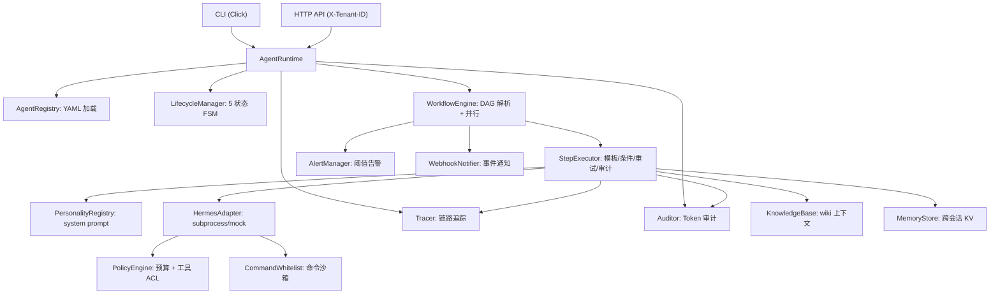
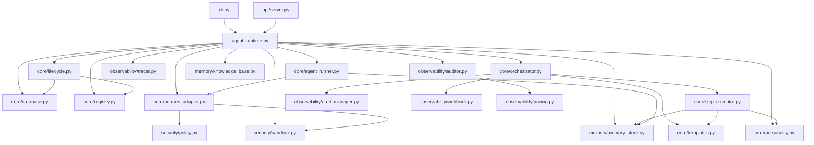

# SCCS OS Architecture Framework — 7-Domain Design

> 版本: v0.7.0 | 最后更新: 2026-07-20
> 对应: ADR-003, ADR-004 (v0.6.4→v0.7.0 重构)

## 核心原则

1. **不重复造轮子** — 复用 Hermes Agent 的推理、记忆、工具、网关全部能力
2. **分层解耦** — 核心层（自研）与适配层（Hermes API）严格分离
3. **渐进式交付** — 先可用、再稳定、后高阶
4. **默认安全** — 最小权限、最少工具、最窄上下文
5. **多租户原生** — 从 schema 层开始支持租户隔离

## 7-Domain 架构框架

| # | 域 | 职责 | 关键接口 |
|---|-----|------|---------|
| 1 | **多智能体编排** | DAG 拓扑排序、并行 ThreadPool 执行、Jinja2 模板引擎、条件分支、WorkflowRunContext 线程安全 | `WorkflowEngine`, `StepExecutor`, `DAGResolver`, `WorkflowRunContext` |
| 2 | **工具增强型 LLM** | ABC 适配层、子进程桥接 Hermes CLI、策略注入、Personality 注入、retry 瞬态重试 | `HermesAdapter(ABC)`, `HermesSubprocessAdapter`, `PersonalityRegistry` |
| 3 | **Agent 生命周期** | 5 状态状态机 + DB 持久化 + 从 DB 恢复 + AgentRunner 后台线程 + PAUSED 真实停启 | `LifecycleManager`, `AgentStatus`, `AgentInstance`, `AgentRunner`, `AgentProcess` |
| 4 | **可观测性** | Span 追踪、JSON 日志、Token 审计、成本报告、Webhook 通知、阈值告警、trace 合并导出 | `Tracer`, `Logger`, `Auditor`, `PricingTable`, `WebhookNotifier`, `AlertManager` |
| 5 | **安全沙箱** | Budget 预算引擎、工具 ACL 白名单、命令白名单 2 层守卫、per-agent 策略覆盖、危险模式可配置 | `PolicyEngine`, `CommandWhitelist`, `BudgetTracker` |
| 6 | **记忆系统** | 冷记忆桥接(wiki)、TF-IDF 向量检索、KB → 模板注入、跨会话 KV 持久记忆、TTL 过期清理 | `KnowledgeBase`, `VectorStore`, `MemoryStore` |
| 7 | **提示工程** | Agent YAML 定义(personality/profile/model/tenant)、Jinja2 沙箱模板渲染、Personality 系统提示注入、模板引擎可 mock | `AgentSpec`, `Jinja2 SandboxedEnvironment`, `PersonalityRegistry`, `templates.py` |

## 当前评分（v0.7.1 — 架构优化后）

| 域 | 权重 | 评分 | 说明 |
|----|------|:----:|------|
| 多智能体编排 | 20% | **9.5** | WorkflowRunContext 线程安全、StepExecutor 拆分、Schema 校验、条件分支 |
| 工具增强型 LLM | 15% | **8.0** | 三层安全防线、retry 包裹、Mock 一致性、模板引擎可注入 |
| Agent 生命周期 | 15% | **9.5** | 5 状态 FSM + 后台进程 + PAUSED 真实化 + API-Runner 联动 |
| 可观测性 | 15% | **8.5** | 追踪/审计/日志/Webhook/告警 五维一体、trace 合并导出 |
| 安全沙箱 | 10% | **7.5** | 三层防线 + per-agent 覆盖 + 正则化危险模式 + API 策略校验 |
| 记忆系统 | 10% | **8.5** | 知识库 + 向量检索 + 跨会话 KV + agent ask 路径接线 + TTL + purge_expired |
| 提示工程 | 5% | **8.0** | 3 personality 文件 + AgentSpec 完整字段 + 模板引擎可注入 |
| 多租户隔离 | 5% | **7.5** | Schema + API 就绪、get_run_status/cancel_run/list_runs tenant 过滤 |
| 测试质量 | 5% | **9.5** | 157 用例覆盖核心+边缘场景+API+版本验证 |
| **综合** | **100%** | **8.7/10** | |

## 数据流

## 模块依赖图

## 当前技术栈

| 层 | 技术 | 版本约束 |
|----|------|---------|
| 语言 | Python | ≥3.11 |
| 运行时 | Hermes Agent | 通过 CLI subprocess |
| 持久化 | SQLite (WAL + thread-local) | 零外部依赖 |
| 模板 | Jinja2 (SandboxedEnvironment) | ≥3.1 |
| CLI | Click | ≥8.0 |
| 序列化 | PyYAML | ≥6.0 |
| 测试 | pytest | ≥7.0 |

## 架构演进里程碑

| 版本 | 日期 | 关键变化 | 健康评分 |
|------|------|---------|:--------:|
| v0.1 | 2026-06 | 原型：CLI + 基础生命周期 | — |
| v0.2 | 2026-06 | 编排引擎 + DAG 解析 | — |
| v0.3 | 2026-07 | 可观测性 + 安全策略 | — |
| v0.4 | 2026-07-18 | AgentRuntime 统一入口 + 架构审计 | 4.9→6.2 |
| v0.5 | 2026-07-19 | P0+P1+P2 安全加固 + 架构改进 | 7.5 |
| v0.6 | 2026-07-19 | 多租户 + 告警 + Personality + MemoryStore | 8.0 |
| **v0.7** | **2026-07-20** | **PAUSED 真实化 + agent ask 记忆 + 线程安全 + DB 统一 + API 守卫** | **8.5** |
| **v0.7.1** | **2026-07-22** | **API-Runner 联动 + agent list 修复 + step_outputs 线程安全 + tenant 过滤 + Pricing 独立 + 上下文提取** | **8.7** |
| v0.8 (规划) | — | 会话持久化 + OTel + 沙箱增强 | 目标 9.0+ |

## 相关 ADR

- [[ADR-003-sccsos-p0-p1-p2-evolution]] — 前序架构演进
- [[ADR-004-sccsos-v0.7.0-architecture-refactor]] — v0.7.0 架构重构
- [[ADR-004-SCCS-OS-深度架构设计]] — 深度设计方案
- [[ADR-006-sccsos-v0.7.1-architecture-optimization]] — v0.7.1 架构优化
- [[需求分析-SCCS-OS-需求规格说明书]] — 原始需求
