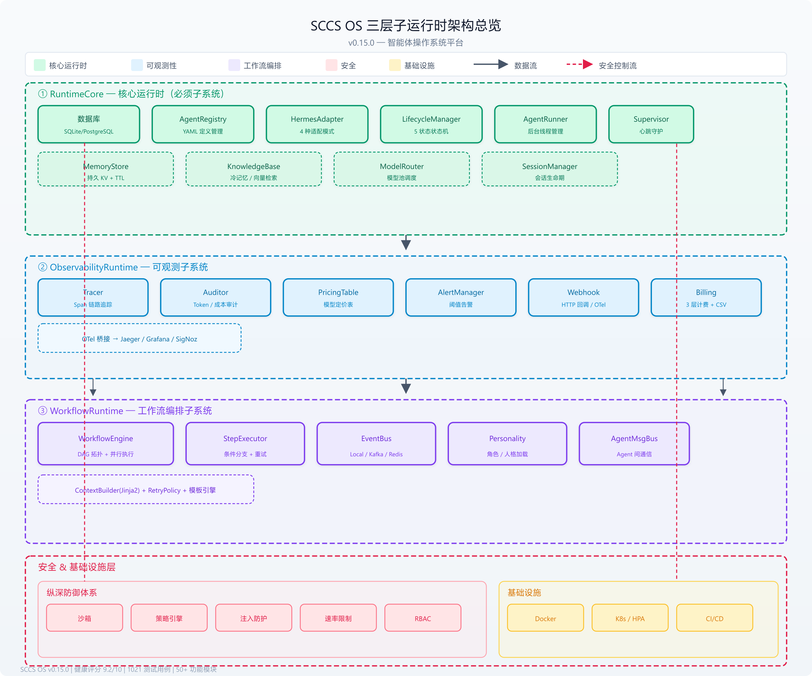

<div class="cover-page">
  <h1>SCCS OS</h1>
  <p class="subtitle">全量架构深度分析报告</p>
  <p class="meta">版本 v0.15.0 · 健康评分 9.2/10 · 2026-07-26</p>
  <p class="meta">创新研究院 李锋</p>
</div>

<div class="toc">
  <h2>目录</h2>
  <ul>
    <li><a href="#sec1">一、架构总览</a></li>
    <li><a href="#sec2">二、核心技术架构</a></li>
    <li><a href="#sec3">三、全量功能清单</a></li>
    <li><a href="#sec4">四、跨层架构模式分析</a></li>
    <li><a href="#sec5">五、数据流拓扑</a></li>
    <li><a href="#sec6">六、架构健康评分</a></li>
    <li><a href="#sec7">七、总结与展望</a></li>
  </ul>
</div>

\newpage

## 一、架构总览 {#sec1}

SCCS OS 是面向多智能体集群的统一管控平台，底层复用 Hermes Agent 运行时内核（推理循环、记忆、技能沙箱），上层自研操作系统级能力。采用**三层子运行时架构**解耦核心、可观测性与工作流编排。

### 1.1 架构全景图



*图1 SCCS OS 三层子运行时架构总览*

### 1.2 设计理念

| 维度 | 理念 | 体现 |
|------|------|------|
| **单一职责** | 每个子系统只做一件事 | 三层子运行时严格分离 |
| **可观测性优先** | 每个操作都可追踪、可审计、可计费 | Tracer + Auditor + Billing |
| **纵深防御** | 安全不止一层 | 沙箱 + 策略 + 注入防护 + 速率限制 + RBAC |
| **声明式配置** | 一切皆 YAML | Agent / Workflow / Personality 定义 |
| **适配器模式** | 核心抽象不依赖具体实现 | HermesAdapter、EventBus、Database 抽象 |

### 1.3 子运行时职责对比

| 特征 | RuntimeCore | ObservabilityRuntime | WorkflowRuntime |
|------|-------------|---------------------|-----------------|
| **职责** | 基础设施与 Agent 管理 | 全链路可观测 | 工作流编排 |
| **必须性** | ✅ 必须 | ✅ 推荐 | ✅ 推荐 |
| **组件数** | 10+ | 8 | 6 |
| **依赖** | 无 | 依赖 RuntimeCore | 依赖 Core + Obs |

\newpage

## 二、核心技术架构 {#sec2}

### 2.1 Agent 运行时生命周期

```
AgentRuntime (Facade — 统一入口)
  ├── RuntimeCore                    # 核心：DB/Registry/Adapter/Runner/Session/Supervisor
  │   ├── Database (SQLite WAL)      # 持久层 + FTS5 + 自动迁移
  │   ├── HermesAdapter              # Hermes CLI 适配器 + 三层安全防线
  │   ├── AgentRunner                # 后台线程进程管理
  │   ├── LifecycleManager           # 5 状态状态机
  │   ├── AgentSessionManager        # 会话管理
  │   ├── Supervisor                 # 心跳检测 + 自动重启
  │   ├── AgentRegistry              # Agent 定义注册
  │   ├── MemoryStore                # 跨会话 KV 记忆
  │   └── ModelRouter                # 多模型路由
  │
  ├── ObservabilityRuntime           # 可观测：追踪/审计/日志/告警/Webhook
  │   ├── Tracer (OTEL/Span)         # 链路追踪
  │   ├── Auditor                    # Token + 操作审计
  │   ├── Logger (JSON)              # 结构化日志
  │   ├── AlertManager               # 阈值告警
  │   ├── Webhook                    # HTTP 回调
  │   └── Pricing                    # LLM 定价表
  │
  └── WorkflowRuntime                # 工作流/策略/事件
      ├── WorkflowEngine             # DAG 编排引擎
      ├── PersonalityRegistry        # 角色配置
      ├── PolicyEngine               # 安全策略
      └── EventBus                   # 事件总线 + 持久化

基础设施层: Docker / K8s / SQLite / Jinja2 / YAML
```

### 2.2 核心模块调用关系

```
AgentRuntime
  ├── RuntimeCore.initialize()
  │     ├── Database.initialize()
  │     ├── AgentRegistry.load_from_dir()
  │     ├── HermesAdapter (create_adapter)
  │     ├── MemoryStore(db)
  │     ├── AgentSessionManager(db)
  │     ├── ModelRouter.from_config()
  │     ├── Supervisor.start()
  │     └── AgentRunner(adapter, memory, session, supervisor, router)
  │
  ├── ObservabilityRuntime.initialize()
  │     ├── Tracer(db, export_path, otel_bridge)
  │     ├── PricingTable(path)
  │     ├── Auditor(db, pricing)
  │     ├── WebhookNotifier(config)
  │     └── AlertManager(db)
  │
  └── WorkflowRuntime.initialize()
        ├── PersonalityRegistry.load_from_dir()
        ├── WorkflowEngineBuilder(...).build()
        ├── EventBus wiring
        └── Webhook + Alert wired
```

\newpage

## 三、全量功能清单 {#sec3}

### 3.1 核心运行时（RuntimeCore）— 12 项

| # | 功能模块 | 说明 | 源文件 |
|---|---------|------|--------|
| 1 | **Agent 定义注册表** | YAML 声明式加载 Agent 定义，支持按标签过滤、目录批量加载 | `core/registry.py` |
| 2 | **5 状态生命周期** | 严格状态机：CREATED→RUNNING→PAUSED/FAILED/TERMINATED | `core/lifecycle.py` |
| 3 | **Agent 后台进程** | 每个 Agent 独立守护线程，任务队列，同步 ask() 与超时控制 | `core/agent_runner.py` |
| 4 | **Hermes 子进程适配** | `hermes -p <profile> -z <prompt>` 封装，三层安全防线 + 退避重试 | `core/hermes_adapter.py` |
| 5 | **Docker Hermes 适配** | `docker exec` 集成容器化 Hermes | `core/hermes_docker_adapter.py` |
| 6 | **远程 Hermes 适配** | HTTP REST 代理，分布式 Worker 节点 | `core/hermes_remote_adapter.py` |
| 7 | **Hermes 安装管理** | 7 模式自动检测，doctor 诊断报告 | `core/hermes_manager.py` |
| 8 | **守护进程监控** | 心跳守护 + 自动重启（最多 N 次） | `core/supervisor.py` |
| 9 | **数据库持久层** | SQLite WAL / PostgreSQL，自动迁移，FTS5 | `core/db/` |
| 10 | **配置管理** | YAML 驱动，嵌套数据类，热重载 | `core/config.py` |
| 11 | **会话管理** | Agent 会话生命周期，pause→resume 上下文延续 | `core/session.py` |
| 12 | **模型路由** | 动态模型选择，capability 匹配，成本排序，失败回退 | `core/model_router.py` |

### 3.2 工作流编排（WorkflowRuntime）— 8 项

| # | 功能模块 | 说明 | 源文件 |
|---|---------|------|--------|
| 1 | **DAG 拓扑排序** | 步骤依赖分析，分层执行顺序 | `core/workflow/dag.py` |
| 2 | **DAG 工作流引擎** | 按层执行，串行 + 并行 ThreadPoolExecutor | `core/workflow/engine.py` |
| 3 | **条件分支执行** | 条件表达式判断，Jinja2 模板上下文 | `core/step_executor.py` |
| 4 | **退避重试策略** | 可配置最大重试 + 指数退避 | `core/retry_policy.py` |
| 5 | **Jinja2 上下文装配** | 前序输出 + 输入装配为模板上下文 | `core/context_builder.py` |
| 6 | **工作流定义模型** | 声明式 YAML 定义 steps/condition/parallel_groups | `core/workflow/definition.py` |
| 7 | **角色/人格管理** | YAML 加载，版本管理 | `core/personality.py` |
| 8 | **角色包安装** | 一站式部署：人格 + Agent + 技能 + 工作流 | `roles/`, `cli/role_cmd.py` |

### 3.3 事件总线（EventBus）— 4 项

| # | 功能模块 | 说明 | 源文件 |
|---|---------|------|--------|
| 1 | **事件总线抽象** | on/off/emit/has_handlers/clear 接口 | `core/event_bus.py` |
| 2 | **本地事件总线** | 进程内 pub/sub，handler 故障隔离 | `core/event_bus.py` |
| 3 | **Kafka 事件总线** | 分布式，熔断器 CLOSED→OPEN→HALF_OPEN | `core/event_bus_kafka.py` |
| 4 | **Redis PubSub 桥接** | 跨 Worker 广播，防无限循环，自动重连 | `core/event_bus_redis.py` |

### 3.4 Agent 间通信 — 1 项

| # | 功能模块 | 说明 | 源文件 |
|---|---------|------|--------|
| 1 | **Agent 消息总线** | request/response/broadcast 通信，持久化 + correlation_id 配对 | `core/agent_message_bus.py` |

### 3.5 API 服务层 — 12 个路由

| # | 路由 | 说明 |
|---|------|------|
| 1 | `/api/v1/agents` | Agent CRUD + ask 对话 |
| 2 | `/api/v1/workflows` | 工作流提交/状态/取消 |
| 3 | `/api/v1/sessions` | 会话历史查询 |
| 4 | `/api/v1/traces` | 链路追踪查询/导出 |
| 5 | `/api/v1/audit` | Token 审计查询 |
| 6 | `/api/v1/skills` | 技能市场发布/审批/安装 |
| 7 | `/api/v1/billing` | 账单查询/汇总/CSV 导出 |
| 8 | `/api/v1/quotas` | 配额管理 |
| 9 | `/api/v1/maintenance` | 维护任务触发 |
| 10 | `/api/v1/webhooks` | Webhook 管理 |
| 11 | `/api/v1/health` | 健康检查 |
| 12 | `/ws` | WebSocket 实时推送 |

### 3.6 CLI 命令行层 — 18 个子命令

| # | 子命令 | 说明 |
|---|--------|------|
| 1 | `sccsos init` | 初始化项目（支持 --samples / --interactive / --role） |
| 2 | `sccsos agent` | Agent CRUD + start/stop/pause/resume/ask |
| 3 | `sccsos workflow` | 工作流执行/列表/状态 |
| 4 | `sccsos trace` | 链路追踪查询 |
| 5 | `sccsos audit` | 审计报告 |
| 6 | `sccsos memory` | 持久记忆读写 |
| 7 | `sccsos session` | 会话管理 |
| 8 | `sccsos personality` | Personality CRUD |
| 9 | `sccsos skill` | 技能市场操作 |
| 10 | `sccsos quota` | 配额管理 |
| 11 | `sccsos billing` | 计费查询/汇总/CSV |
| 12 | `sccsos config` | 配置查看/webhook/热重载 |
| 13 | `sccsos hermes` | Hermes 安装/诊断 |
| 14 | `sccsos role` | 角色包安装 |
| 15 | `sccsos plugin` | 插件列表/注册 |
| 16 | `sccsos maintenance` | 维护触发 |
| 17 | `sccsos benchmark` | 压测运行 |
| 18 | `sccsos serve` | 启动 API 服务器 |

### 3.7 可观测性 — 8 项

| # | 功能模块 | 说明 | 源文件 |
|---|---------|------|--------|
| 1 | **Span 链路追踪** | 父子 Span 树，时序/状态/事件记录 | `observability/tracer.py` |
| 2 | **OpenTelemetry 桥接** | 对接 Jaeger/Grafana/SigNoz | `observability/otel_tracer.py` |
| 3 | **Token 审计** | LLM Call / Tool Call 全程记录 | `observability/auditor.py` |
| 4 | **LLM 定价表** | JSON 定价文件，TTL 热重载 | `observability/pricing.py` |
| 5 | **阈值告警** | 工作流完成后评估指标 | `observability/alert_manager.py` |
| 6 | **Webhook 通知** | HTTP 回调通知 | `observability/webhook.py` |
| 7 | **JSON 结构化日志** | JSON 格式，按天轮转 | `observability/logger.py` |
| 8 | **多层级计费** | 按 Token / 按调用 / 固定订阅 | `observability/billing.py` |

### 3.8 安全体系 — 5 项

| # | 功能模块 | 说明 | 源文件 |
|---|---------|------|--------|
| 1 | **策略引擎** | 预算上限，per-Agent 隔离，命名策略 | `security/policy.py` |
| 2 | **命令沙箱** | 危险模式 + 白名单 + 注入检测 | `security/sandbox.py` |
| 3 | **注入防护** | 多语言模式，Unicode 归一化，敏感数据脱敏 | `security/injection.py` |
| 4 | **速率限制** | 令牌桶，per-Agent/per-Tenant | `security/ratelimit.py` |
| 5 | **RBAC 权限** | admin/operator/viewer，路由级 | `security/rbac.py` |

### 3.9 记忆系统 — 4 项

| # | 功能模块 | 说明 | 源文件 |
|---|---------|------|--------|
| 1 | **持久 KV 记忆** | per-Tenant/per-Agent key-value，TTL 过期 | `memory/memory_store.py` |
| 2 | **知识库桥接** | 冷记忆，懒加载 + 增量刷新 + 缓存 | `memory/knowledge_base.py` |
| 3 | **TF-IDF 向量检索** | 零外部依赖语义搜索，中英文混合 | `memory/vector_store.py` |
| 4 | **Chroma 存储** | Chroma 向量数据库集成 | `memory/chroma_store.py` |

### 3.10 技能市场 — 3 项

| # | 功能模块 | 说明 | 源文件 |
|---|---------|------|--------|
| 1 | **技能市场** | 发布→审批→安装→归档全生命周期 | `skill_market/__init__.py` |
| 2 | **技能评级** | 1-5 星评分，排行统计 | `skill_rating.py` |
| 3 | **技能评审** | 审批评论 + 版本差异对比 | `core/skill_review.py` |

\newpage

## 四、跨层架构模式分析 {#sec4}

### 4.1 依赖注入模式（Builder）

```
StepExecutorBuilder    → StepExecutor
WorkflowEngineBuilder  → WorkflowEngine
AgentRuntime           → RuntimeCore + ObservabilityRuntime + WorkflowRuntime
```

所有核心组件通过 Builder 模式装配，依赖在构建时注入。

### 4.2 适配器模式（Strategy）

```
HermesAdapter (ABC)
  ├── HermesSubprocessAdapter  (本地子进程)
  ├── DockerHermesAdapter      (Docker exec)
  ├── RemoteHermesAdapter      (HTTP 远程)
  └── MockHermesAdapter        (测试模式)
```

### 4.3 抽象工厂模式

```
create_adapter(mode="auto")  → 自动探测安装模式并选择适配器
configure_event_bus(backend) → local / kafka 自动切换
ModelRouter.from_config()    → 从配置动态构建模型池
```

### 4.4 熔断器模式

```
KafkaEventBus → CircuitBreaker (CLOSED → OPEN → HALF_OPEN)
               failure_threshold=5, recovery_timeout=30s
```

### 4.5 状态机模式

```
LifecycleManager → 5 状态 + 8 条转换边（严格矩阵校验）
SkillMarket      → 5 状态 (draft → in_review → published → archived)
CircuitBreaker   → 3 状态 (closed → open → half_open)
```

\newpage

## 五、数据流拓扑 {#sec5}

```
User Input
  ├── CLI (Click)
  │     └── AgentRuntime.ask(agent_name, prompt)
  │           ├── PolicyEngine.check_delegation()    [预算检查]
  │           ├── CommandWhitelist.check()           [沙箱检查]
  │           └── AgentProcess._build_prompt()
  │                 ├── KnowledgeBase.get_context()  [冷记忆]
  │                 ├── MemoryStore.get_all()        [热记忆]
  │                 ├── SessionManager.get_history() [会话历史]
  │                 └── HermesAdapter.delegate_task()→ Hermes Agent
  │
  ├── FastAPI (HTTP)
  │     └── RBAC → Route Handler → AgentRuntime
  │
  └── Workflow (YAML)
        └── WorkflowEngine.execute()
              ├── DAGResolver.get_execution_order()
              ├── StepExecutor (per step)
              │     ├── ContextBuilder.build()
              │     ├── Condition Check → skip?
              │     └── HermesAdapter → TaskResult
              ├── Tracer.start_span/end_span
              ├── EventBus.emit(WORKFLOW_*)
              └── Webhook.fire() / AlertManager.evaluate()
```

\newpage

## 六、架构健康评分 {#sec6}

### 6.1 12 维度评分

| 维度 | 得分 | 说明 |
|------|:----:|------|
| **模块化** | 9.5 | 三层子运行时已高度解耦，职责清晰 |
| **可测试性** | 9.0 | 1021 测试用例，MockHermesAdapter 全覆盖 |
| **可观测性** | 9.5 | Span/审计/日志/告警/Webhook 全套 |
| **安全性** | 9.0 | 5 层纵深防御体系 |
| **扩展性** | 8.5 | EventBus 的 Redis/Kafka 需额外依赖 |
| **文档完整性** | 9.0 | 输出/ 全套文档 + Wiki 体系 |
| **生产就绪度** | 9.5 | K8s/HPA/Docker/压测已验证 |
| **一致性** | 9.0 | 版本同步验证完善 |
| **性能** | 8.5 | 需建立持续性能基线 |
| **可运维性** | 9.0 | CLI + API + 维护调度完整 |
| **弹性** | 9.0 | Supervisor 自动恢复，熔断器 |
| **API 设计** | 9.5 | RESTful + 版本化 + WebSocket |
| **总分** | **9.2** | 生产级就绪 |

### 6.2 优化方向

| 优先级 | 方向 | 当前状态 |
|--------|------|---------|
| P0 | Locust 500+ 并发压测 + 性能基线 | 待实施 |
| P0 | 72h 长期运行稳定性验证 | 待实施 |
| P1 | K8s 生产环境全流程验证 | 待实施 |
| P1 | Billing UI 订阅管理 | 已规划 |

\newpage

## 七、总结与展望 {#sec7}

### 7.1 当前能力评估

**SCCS OS 已成为一个完备的智能体操作系统平台**，覆盖从底层 Agent 进程管理到上层工作流编排、从安全策略到商业化计费的完整能力栈。

### 7.2 核心设计亮点

1. **三层子运行时架构** — 核心/可观测/工作流严格分离，易维护易扩展
2. **Hermes 适配器体系** — 4 种模式覆盖开发/测试/生产/远程部署
3. **全链路可观测** — 从 Span 追踪到 Token 审计到计费输出，一条龙
4. **多层纵深防御** — 沙箱 + 策略 + 注入防护 + 速率限制 + RBAC
5. **多模式部署** — 单进程 → Docker → K8s + HPA

### 7.3 下一步规划

- **企业级规模化**: Locust 500+ 并发压测 + 性能基线报告
- **稳定性验证**: 72h 长期运行 + 资源泄漏监控
- **商业化体系**: Billing 多层级计费（UI 层面）
- **文档知识库**: ADR 覆盖 v0.9.0~v0.15.0 全版本
- **生产就绪**: K8s 全流程验证（Helm + HPA）

---

*SCCS OS v0.15.0 — 本文档由创新研究院自动生成*
